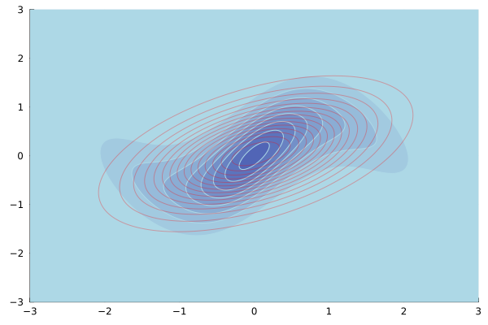

# ApproximateVI.jl

[](https://www.repostatus.org/#wip)
[](https://ngiann.github.io/ApproximateVI.jl)


# What is this?

A Julia package for approximating a posterior distribution with a full-covariance Gaussian distribution[^1]. Currently, more documentation is added to the package. In the future it is planned to introduce a mean-field approximation.


## Basic usage

The package is fairly easy to use. Currently, the only function of interest to the user is `VI`. At the very minimum, the user needs to provide a function that codes the joint log-likelihood function.

Consider approximating a target density given by a three-component mixture model:

```
using ApproximateVI

logp = exampleproblem1() # target log-posterior to approximate
x₀ = randn(2)            # random initial mean for approximating Gaussian
q, logev = VI(logp, randn(2), S = 100, iterations = 10_000, show_every = 50)

# Plot target posterior, not log-posterior!
using Plots # must be indepedently installed.
x = -3:0.02:3
contour(x, x, map(x -> exp(logp(collect(x))), Iterators.product(x, x))', fill=true, c=:blues)

# Plot Gaussian approximation on top using red colour
contour!(x, x, map(x -> pdf(q,(collect(x))), Iterators.product(x, x))', color="red", alpha=0.2)
```

The filled blue contours correspond to the exponentiated `logp`, and the red contours correspond to the produced Gaussian approximation `q`.


For further information, please consult the documentation.

[^1]:[Approximate Variational Inference Based on a Finite Sample of Gaussian Latent Variables](https://doi.org/10.1007/s10044-015-0496-9), [[Arxiv]](https://arxiv.org/pdf/1906.04507.pdf).
