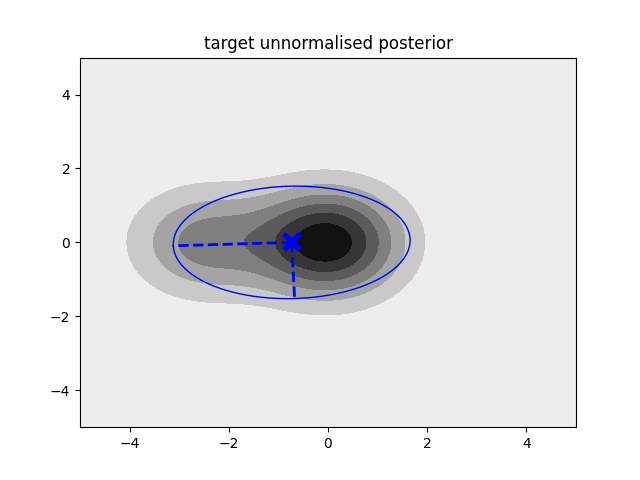

# ApproximateVI.jl

[](https://www.repostatus.org/#wip)
[](https://ngiann.github.io/ApproximateVI.jl)


# What is this?

A Julia package for approximate Bayesian inference for non-conjugate probabilistic models[^1].


## Basic usage

The package is fairly easy to use. Currently, the only function of interest to the user is `VI`. At the very minimum, the user needs to provide a function that codes the joint log-likelihood function.

Consider approximating a target density given by a three-component mixture model:

```
using PyPlot # Must be indepedently installed. 
             # Needed for plotting, alternatively other packages can be used.

# Define means for three-component Gaussian mixture model
# All components are implicitly equally weighted and have unit covariance
μ = [zeros(2), [2.5; 0.0], [-2.5; 0.0]]

# Define log-likelihood
logp(θ) = log(exp(-0.5*sum((μ[1].-θ).^2)) + exp(-0.5*sum((μ[1].-θ).^2)) + exp(-0.5*sum((μ[3].-θ).^2)))
```

We will now approximate it with a Gaussian density. We need to pass to ```VI``` the log-likelihood function, a starting point for the mean of the approximate Gaussian posterior, as well as the number of fixed samples and the number of iterations we want to optimise the lower bound for:

```
posterior, logevidence = VI(logp, randn(2); S = 100, iterations = 30)
```

This returns two outputs: the first one is the approximating posterior q(θ) of type ```MvNormal``` (see [Distributions.jl](https://github.com/JuliaStats/Distributions.jl)). The second output is the approximate lower bound of type ```Float64```.

Below we plot as contour plot the target unnormalised posterior distribution.
We also plot the approximating posterior q(θ) as a blue ellipse:




[^1]:[Approximate Variational Inference Based on a Finite Sample of Gaussian Latent Variables](https://doi.org/10.1007/s10044-015-0496-9), [[Arxiv]](https://arxiv.org/pdf/1906.04507.pdf).
